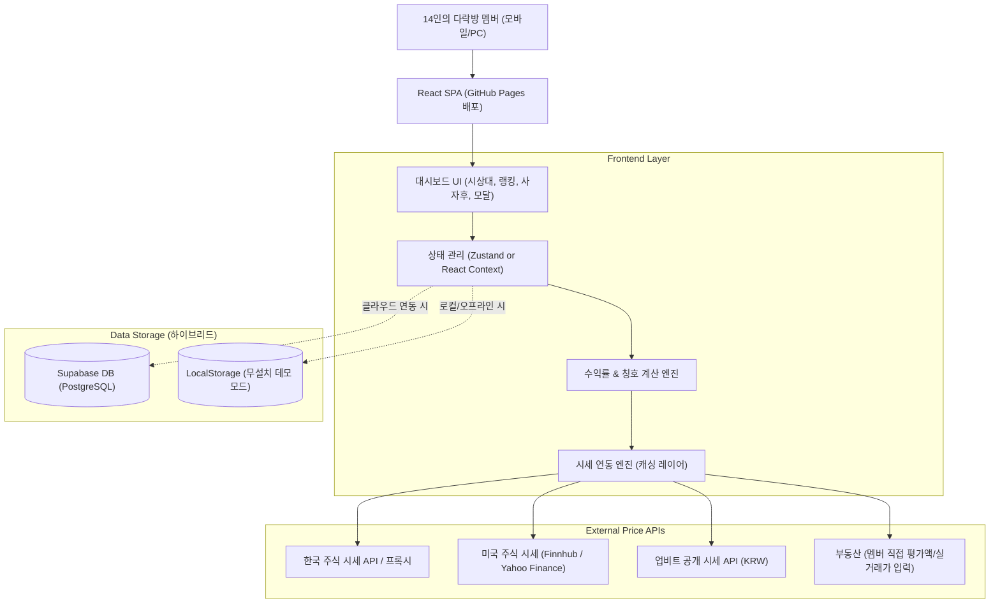

# 다락방포트폴리오 (Attic Portfolio) 설계 사양서

- **작성일**: 2026-09-30
- **프로젝트 명**: 다락방포트폴리오 (Attic Portfolio)
- **대상 사용자**: 14인의 다락방 투자 모임 멤버
- **목적**: 각 멤버의 주식 및 부동산 투자 종목과 평단가를 바탕으로 현재 시세 대비 실시간 수익률 랭킹을 집계하고, 유쾌한 칭호와 게이미피케이션 요소로 멤버 간의 유대감과 재미를 극대화하는 웹 애플리케이션

---

## 1. 시스템 아키텍처 & 기술 스택

### 1.1 기술 스택
- **프론트엔드 프레임워크**: React 18 / 19 + TypeScript + Vite
- **스타일링**: Tailwind CSS (반응형 모바일 우선 설계, 아늑한 다락방 앰버/다크 우드 테마)
- **아이콘 & 비주얼**: Lucide React, Canvas-Confetti (1위 및 시상대 팡파르 폭죽 효과)
- **차트**: Recharts 또는 커스텀 SVG 원형/바 차트 (포트폴리오 비중 시각화)
- **데이터베이스 & 백엔드**:
  - **클라우드 모드**: Supabase (PostgreSQL + Realtime 구독)
  - **오프라인/데모 모드**: 브라우저 LocalStorage 기반 (별도 DB 연결 없이도 즉시 14명 가상 데이터와 함께 100% 정상 구동)
- **호스팅 및 배포**: GitHub Pages (GitHub Actions를 통한 자동 빌드 및 배포)

### 1.2 시스템 아키텍처 다이어그램



---

## 2. 데이터 모델

### 2.1 멤버 (`Member`)
```typescript
interface Member {
  id: string; // 고유 ID (예: 'member-1')
  name: string; // 이름 또는 닉네임 (예: '철수', '영희')
  pin: string; // 4자리 간이 비밀번호 (본인 자산 수정용)
  avatar: string; // 프로필 이모지 또는 아바타 이미지 URL
  bio: string; // 멤버 소개 한마디
  updatedAt: string; // 최근 포트폴리오 업데이트 시각
}
```

### 2.2 자산/종목 (`Asset`)
```typescript
type AssetType = 'kr_stock' | 'us_stock' | 'crypto' | 'real_estate' | 'cash';

interface Asset {
  id: string;
  memberId: string;
  type: AssetType;
  name: string; // 종목명 또는 부동산명 (예: '삼성전자', '애플', '비트코인', '마포래미안 59㎡')
  symbol: string; // 티커/종목코드 (예: '005930', 'AAPL', 'BTC', 'RE-01')
  buyPrice: number; // 매수 평단가 (원화 기준, 미국 주식은 원화 환산 기준)
  quantity: number; // 보유 수량 (주식/코인은 수량, 부동산은 보통 1 또는 지분율)
  currentPrice: number; // 현재 시세 (주식/코인은 자동 갱신, 부동산은 입력가)
  currency: 'KRW' | 'USD';
  memo?: string; // 투자 메모 (예: "3년 장투", "존버")
}
```

### 2.3 다락방 한줄 사자후 (`Shoutout`)
```typescript
interface Shoutout {
  id: string;
  memberId: string;
  memberName: string;
  avatar: string;
  message: string; // 상태 메시지 또는 절규/환호
  createdAt: string;
  reactionCount: number; // 공감 수
}
```

---

## 3. 핵심 비즈니스 로직

### 3.1 시세 연동 정책
1. **한국 주식 (`kr_stock`)**: 네이버 증권 또는 공개 주가 API 연동. 요청 실패 시 기본/최근 시세 캐시 유지.
2. **미국 주식 (`us_stock`)**: Finnhub / Yahoo Finance 공개 엔드포인트 연동 (USD/KRW 실시간 환율 곱산).
3. **가상자산 (`crypto`)**: Upbit 공개 REST API (`https://api.upbit.com/v1/ticker?markets=KRW-BTC,...`) - 별도 키 없이 무료 실시간 호출 가능.
4. **부동산 (`real_estate`)**: 부동산 특성상 실시간 단일 호가가 없으므로, 사용자가 '취득가(매수가)'와 '현재 평가액(최근 실거래가/KB호가)'을 직접 입력 및 수시 변경.

### 3.2 평가액 및 수익률 계산 공식
- **개별 종목 평가금액**: `CurrentValue = Quantity * CurrentPrice`
- **개별 종목 매수원금**: `InvestedAmount = Quantity * BuyPrice`
- **개별 종목 손익**: `Profit = CurrentValue - InvestedAmount`
- **개별 종목 수익률(%)**: `(Profit / InvestedAmount) * 100`
- **멤버 총 자산**: `TotalValue = SUM(개별 종목 CurrentValue)`
- **멤버 총 투자원금**: `TotalInvested = SUM(개별 종목 InvestedAmount)`
- **멤버 총 수익률(%)**: `((TotalValue - TotalInvested) / TotalInvested) * 100`

### 3.3 랭킹 및 유쾌한 칭호 부여 알고리즘
멤버들의 수익률과 자산 구성을 분석하여 자동으로 훈장 및 칭호를 부여:
1. **1위 (수익률 챔피언)**: 👑 **"다락방 워런 버핏"** (트로피, 골드 하이라이트, 팡파르 이펙트)
2. **2위**: 🥈 **"다락방 찰리 멍거"**
3. **3위**: 🥉 **"다락방 피터 린치"**
4. **꼴찌 (최하위 수익률)**: 🛟 **"한강 수온 체크반장"** (구출 튜브 이펙트, 따뜻한 위로 모달)
5. **자산 규모 1위**: 💰 **"다락방 만수르"** (원금 깡패)
6. **마이너스 20% 이하**: 🥶 **"냉동인간 존버단"**
7. **부동산 비중 70% 이상**: 🏢 **"영끌 대마왕"**
8. **코인 비중 50% 이상**: 🚀 **"야수형 불나방"**
9. **미국 주식 비중 70% 이상**: 🗽 **"잠 못 드는 서학개미"**

---

## 4. UI/UX 디자인 & 게이미피케이션 연출

### 4.1 테마 & 분위기
- **컨셉**: "아늑하고 비밀스러운 우리만의 다락방 아지트"
- **메인 컬러**: 앰버/골드 (`amber-400`, `amber-500`), 딥 네이비/우드 브라운 배경 (`slate-900`, `amber-950/20`)
- **반응형**: 모바일 웹에서 앱처럼 부드럽게 스크롤되며 모든 기능 조작 가능

### 4.2 주요 컴포넌트
1. **Header & Attic Ticker**:
   - 다락방 로고, 14명 총합 자산, 전체 평균 수익률, 실시간 장 상태(개장/휴장)
   - "내 포트폴리오 관리" 퀵 버튼
2. **사자후 전광판 (Shoutout Ticker & Board)**:
   - 14명의 멤버가 남긴 한마디가 상단에 유쾌하게 흐르고, 클릭 시 전체 메시지 보기 및 새 사자후 등록 모달
3. **Top 3 시상대 (Podium) & 꼴찌 구출석**:
   - 2위 - 1위 - 3위 순서로 높낮이가 다른 시상대 배치
   - 1위 클릭 시 축하 팡파르 폭죽 (`canvas-confetti`) 연출
   - 그 옆에 "오늘의 구출 대상" 카드로 꼴찌 멤버에게 구명의 손길(응원하기 버튼) 제공
4. **전체 랭킹 보드 (Leaderboard Table & Cards)**:
   - 모바일: 카드형 뷰, 데스크탑: 반응형 테이블
   - 순위, 아바타, 닉네임, 칭호 배지, 총 자산(원화 포맷), 총 수익률(빨강/파랑 색상 구분), 보유 종목 태그
   - 행 클릭 시 상세 종목별 도넛 차트 및 종목 리스트 모달 팝업
5. **포트폴리오 관리 모달 (Member Asset Manager)**:
   - 본인 이름 선택 및 4자리 PIN 입력
   - 보유 주식/코인/부동산 추가, 수정, 삭제
   - 즉시 수익률 반영 및 미리보기

---

## 5. 배포 및 데이터베이스 설정 가이드

### 5.1 하이브리드 동작 모드
1. **기본 모드 (LocalStorage)**:
   - `.env`에 Supabase 설정이 없으면 자동으로 14명의 현실감 있고 재미있는 가상 데이터로 초기화되어 즉시 구동.
   - 브라우저에서 직접 데이터를 수정하면 LocalStorage에 유지되어 발표 및 시연에 무결함.
2. **클라우드 모드 (Supabase)**:
   - Supabase 무료 프로젝트 생성 후 제공되는 `supabase_schema.sql`을 실행.
   - `VITE_SUPABASE_URL`, `VITE_SUPABASE_ANON_KEY`를 설정하면 14명이 각자 스마트폰으로 실시간 동기화.

### 5.2 GitHub Pages 배포 설정
- GitHub Actions 워크플로우 `.github/workflows/deploy.yml` 작성:
  - `main` 브랜치에 push 시 자동으로 `npm run build` 실행
  - GitHub Pages로 자동 배포
  - Base URL 자동 매핑 설정 (`vite.config.ts`의 `base: './'`)
